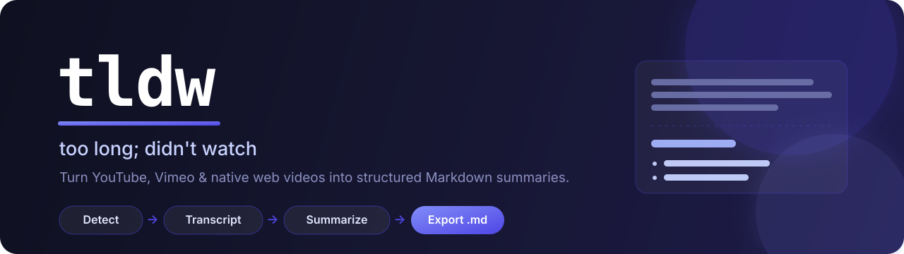
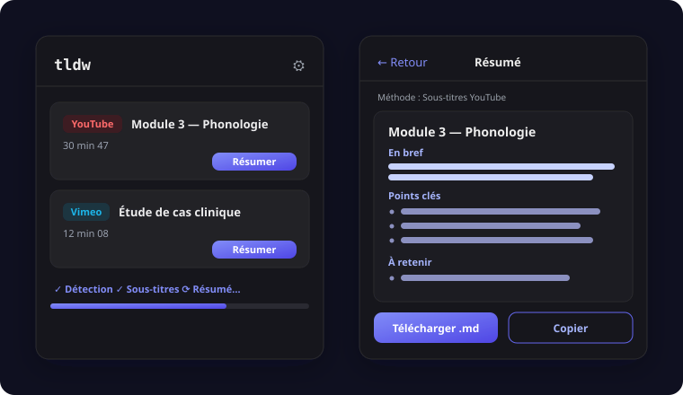

<div align="center">



<br/>

**A Manifest V3 browser extension that turns the videos on a page — YouTube, Vimeo, or any native HTML5 `<video>` — into structured Markdown summaries, even behind a login.**

Runs entirely in your browser, with your own API keys. No backend. No subscription. No tracking.

<br/>

[](https://github.com/adrnbttr/tldw/actions/workflows/ci.yml)
[](./LICENSE)
[](https://developer.chrome.com/docs/extensions/mv3/intro/)
[](https://www.typescriptlang.org/)
[](./CONTRIBUTING.md)

</div>

---

## Table of contents

- [Why](#why)
- [Preview](#preview)
- [Features](#features)
- [How it works](#how-it-works)
- [Install](#install)
- [Configuration](#configuration)
- [Usage](#usage)
- [Tech stack](#tech-stack)
- [Project structure](#project-structure)
- [Development](#development)
- [Roadmap](#roadmap)
- [Privacy &amp; legal](#privacy--legal)
- [License](#license)

## Why

Educational platforms embed hours of video you don't have time to watch in full. **tldw** detects the video on the page, retrieves the spoken content — captions first, an audio-transcription fallback when there are none — and generates a **consistently structured** summary you can download as Markdown.

Because two summaries from two different extraction paths must read the same, the model never controls the layout: it returns structured JSON, and the Markdown is rendered locally from a **versioned template**. Same formalism, every time.

## Preview

<div align="center">
  
</div>

## Features

- 🎯 **Smart detection** — embedded YouTube &amp; Vimeo players, plus any native `<video>` on any site, kept up to date via a `MutationObserver`.
- 🌍 **Any DRM-free video** — YouTube/Vimeo captions when available, and for everything else (native `<video>` on course platforms, etc.) an audio-transcription fallback. Not just the big two hosts.
- 🌐 **Multilingual UI** — English, Français, Español, Deutsch; pick the interface *and* the summary language independently.
- 🔐 **Works behind authentication** — extraction runs in the tab's own session context.
- 🪜 **Best-effort cascade** — captions first, audio transcription as a fallback (`ffmpeg.wasm` + Gemini/Whisper), then an explicit typed error. Never a silent failure.
- 📐 **Identical output every time** — structured JSON → local Markdown rendering from a versioned template.
- 🧠 **Bring your own model** — Gemini Flash (best value) or Claude Sonnet via OpenRouter, with a hierarchical strategy for very long transcripts.
- 💳 **One provider by default** — audio transcription runs through OpenRouter (Gemini) too, so a single API key covers everything; OpenAI Whisper stays optional.
- 📄 **PDF &amp; Word export** — one-click, nicely formatted **PDF** or **Word (.docx)**, plus clean-text copy, a browsable local history, and multi-video batch processing into a single PDF.
- 🎨 **Selectable templates** — `default` (full) or `compact`, chosen in Settings.
- 🔒 **Private by design** — keys live in `chrome.storage.local` and are only ever sent to the provider they belong to.

## How it works

The extension tries to obtain the video's text in successive levels, dropping one rung on each failure. **Every level produces the same normalized `Transcript` object**, so the summarizer is agnostic to where the text came from — that is what guarantees a constant output formalism.

```
  ┌──────────────────────────────────────────────────────────────┐
  │  Level 1 — Caption track                                       │
  │    YouTube: auto/manual captions   ·   Vimeo: text_tracks      │
  └───────────────┬──────────────────────────────────────────────┘
                  │ NO_CAPTIONS_AVAILABLE
                  ▼
  ┌──────────────────────────────────────────────────────────────┐
  │  Level 2 — Audio transcription                                 │
  │    capture media → isolate audio (ffmpeg.wasm) → Whisper       │
  └───────────────┬──────────────────────────────────────────────┘
                  │ fail
                  ▼
  ┌──────────────────────────────────────────────────────────────┐
  │  Level 3 — Explicit, typed error (what was tried & why)        │
  └──────────────────────────────────────────────────────────────┘
                  │
                  ▼ Transcript ──▶ Summarizer ──▶ template ──▶ Markdown
```

Full details in [`docs/ARCHITECTURE.md`](./docs/ARCHITECTURE.md).

## Install

tldw runs as an **unpacked extension in Developer mode — no account, no Chrome Web
Store, no fee.** It's built for personal use; publishing to the Web Store isn't
planned (the groundwork lives in [`store/`](./store/) if that ever changes).

**Prerequisites:** [Node](https://nodejs.org) ≥ 18 (ships with npm) and a Chromium
browser — Chrome or Edge.

### Fastest: one command

```bash
git clone https://github.com/adrnbttr/tldw.git && cd tldw && ./install.sh
```

`install.sh` checks your setup, installs, builds, and prints a guided walkthrough
(with the `dist/` path copied to your clipboard). Then just do step 2 and 3 below.
Prefer to do it by hand? The manual steps are right here:

### 1 · Build it

```bash
git clone https://github.com/adrnbttr/tldw.git
cd tldw
npm install
npm run build          # → dist/
```

### 2 · Load it in the browser

1. Open `chrome://extensions` (or `edge://extensions`)
2. Toggle **Developer mode** (top-right)
3. Click **Load unpacked** and select the `dist/` folder
4. Pin tldw to the toolbar (optional, but handy)

### 3 · Add your API key — required before the first summary

Open the tldw popup → **⚙️ Settings** → paste your
[OpenRouter key](https://openrouter.ai/keys) → **Save**. Without it, summarizing
stops with *“Clé OpenRouter manquante.”* The transcription key is optional (only
used by the audio fallback). Keys are stored locally — see [Configuration](#configuration).

### Updating

Unpacked extensions don't auto-update. After pulling changes, rebuild:

```bash
git pull && ./install.sh      # or: npm install && npm run build
```

Then open `chrome://extensions` and click the **↻ reload** icon on the tldw card —
otherwise the browser keeps the old build.

### On another computer

Same deal, no account: copy the built `dist/` folder over and **Load unpacked** it,
or clone the repo there and run `npm install && npm run build`.

### Troubleshooting

| Symptom | Fix |
|---|---|
| “Aucune vidéo trouvée” | Start playback, then reopen the popup — detection runs on the live page. |
| “Clé OpenRouter manquante” | Add your key in **⚙️ Settings** (step 3). |
| Changes not showing after a rebuild | Click **↻ reload** on the extension card in `chrome://extensions`. |
| Iterating on the code | Run `npm run dev` and load the `dist/` it writes — it hot-reloads on save. |

## Configuration

Open the popup → **⚙️ Settings**:

| Setting | Purpose |
|---|---|
| **OpenRouter API key** | Summaries **and** audio transcription by default — a single provider to pay. Grab one at [openrouter.ai/keys](https://openrouter.ai/keys). |
| **Audio transcription** | For videos without captions. Default: **OpenRouter (Gemini)** — reuses your OpenRouter key, nothing else to set up. Optionally switch to **OpenAI Whisper** (needs a separate [OpenAI key](https://platform.openai.com/api-keys)) for word-level timings. |
| **Summary model** | `Claude Sonnet` (recommended for format fidelity) or `Gemini Flash` for very long transcripts. |
| **Interface language** | English · Français · Español · Deutsch (applies instantly). |
| **Summary language / detail level** | Language of the generated summary, and how concise it is. |

Keys are stored locally and never leave your browser except toward the provider they target. See [`docs/PRIVACY.md`](./docs/PRIVACY.md).

## Usage

1. Open a page with a video and start playback.
2. Click the tldw icon — detected videos are listed.
3. Hit **Résumer**. Processing continues even if you close the popup.
4. Read the rendered summary, then **Download (.md)** or **Copy**.

## Tech stack

| Area | Choice |
|---|---|
| Platform | Manifest V3 (Chrome / Edge) |
| Language | TypeScript (strict) |
| UI | Preact |
| Build | Vite + `@crxjs/vite-plugin` |
| Audio | `ffmpeg.wasm` (single-threaded core) in an offscreen document |
| Tests | Vitest |
| Quality | ESLint + Prettier, GitHub Actions CI |
| APIs | OpenRouter (summaries + audio transcription) · OpenAI Whisper (optional) |
| Export | PDF (`jsPDF`) · Word (`docx`) |

## Project structure

```
src/
├── background/     service worker + orchestrator (the cascade)
├── content/        DOM detection (pure helpers in detect.ts)
├── popup/          Preact UI + components (list · processing · result · settings)
├── adapters/       youtube.ts · vimeo.ts · registry
├── transcription/  audio-fallback: media · chunker · whisper · ffmpeg (isolated)
├── offscreen/      offscreen document that runs the audio pipeline
├── summarizer/     openrouter.ts · versioned template · hierarchical summary
├── storage/        chrome.storage wrappers
├── shared/         format & markdown helpers
└── types/          the shared contracts — single source of truth
```

## Development

```bash
npm run dev      # Vite dev server + HMR
npm run build    # typecheck + production build
npm test         # unit tests (Vitest)
npm run lint     # ESLint + Prettier check
npm run format   # apply Prettier
```

To validate the extension in a real browser (phase by phase, with debugging tips),
follow [`docs/TESTING.md`](./docs/TESTING.md), and [`docs/SCREENSHOTS.md`](./docs/SCREENSHOTS.md)
to capture the README shots. Contributions are welcome — see
[`CONTRIBUTING.md`](./CONTRIBUTING.md) and the [`Code of Conduct`](./CODE_OF_CONDUCT.md).
Security reports: [`SECURITY.md`](./SECURITY.md).

## Roadmap

- [x] **Phase 1** — detection, YouTube adapter, OpenRouter summary, popup, export
- [x] **Phase 2** — Vimeo adapter (level 1: `text_tracks`)
- [x] **Phase 3** — audio transcription fallback (`ffmpeg.wasm` + Gemini/Whisper, in an offscreen document); reconstructs Vimeo DASH audio and transcribes it. *Validated on real private, captionless Vimeo.*
- [x] **Phase 4** — batch processing, history browser, multiple templates, quota handling

Detailed roadmap in [`docs/ROADMAP.md`](./docs/ROADMAP.md).

## Privacy &amp; legal

Extracting content behind authentication may be governed by a site's terms of use. **Confirming that your usage is permitted is your responsibility.** tldw is built for personal use on content you legitimately have access to, and never attempts to bypass DRM — encrypted media surfaces a `MEDIA_PROTECTED` error instead.

Read the [privacy policy](https://www.adrienbouttier.com/tldw/) · [`docs/PRIVACY.md`](./docs/PRIVACY.md).

## License

[MIT](./LICENSE) © Adrien Bouttier
